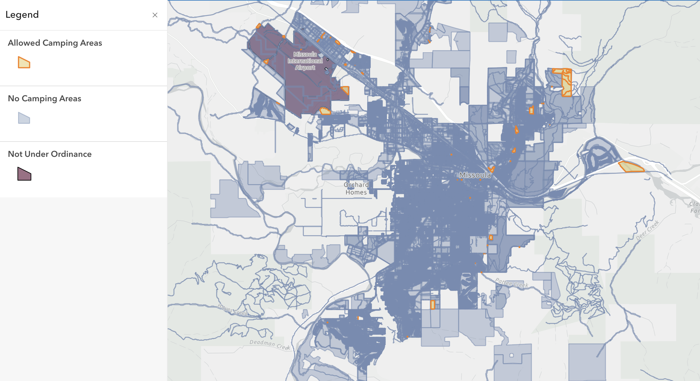
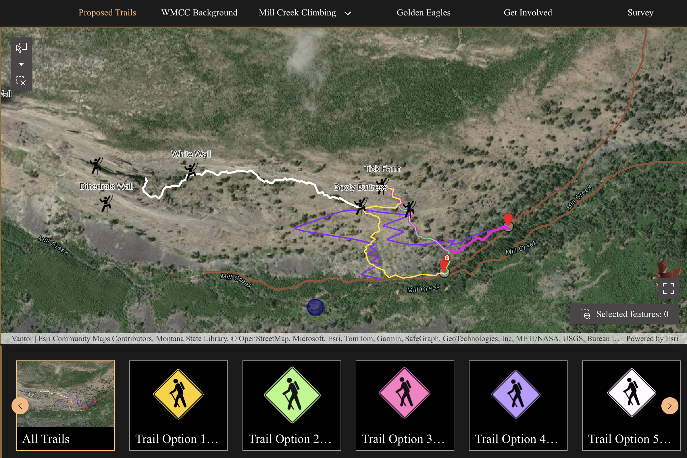

# Mikaela Bollag-Miller  
Hydrogeology & GIS Portfolio

## About Me
I am a hydrogeologist and GIS practitioner with a focus on groundwater systems, hydrologic modeling, and spatial data analysis. My work centers on understanding how water moves through complex subsurface environments, particularly mountain groundwater systems and basin aquifers.

I am especially interested in the intersection of field data, spatial analysis, and numerical modeling. I use GIS, Python, and groundwater modeling tools (e.g., MODFLOW) to integrate datasets such as precipitation, evapotranspiration, river discharge, snowpack, and groundwater levels to better understand recharge processes and aquifer dynamics. My research explores how mountain block recharge, surface water–groundwater interactions, and climatic variability influence groundwater availability.

---

# Projects

## Urban Camping Restrictions — Missoula  
**In Collaberation with:** Natalie Orlik, Chase Sabbagh

### Problem  
Translating Missoula’s urban camping ordinance into a clear spatial representation of where camping is allowed and prohibited within city limits.

### Data & Tools  
- ArcGIS Pro & ArcGIS Online (buffers, merge, erase, dashboard)
- Missoula city boundary  
- Parcel data (residential + commercial)  
- Schools and shelters  
- Parks and conservation lands (easements) 
- Rivers, trails, and bike lanes  

### Output  
- ArcGIS Dashboard showing total allowable vs. restricted camping area  
- Static map layout visualizing buffer restrictions  

### Urban Camping Restrictions — Missoula

[View Dashboard](https://www.arcgis.com/apps/dashboards/34a0352567514c849c5d3712bc825db0)

### Reflection  
This project demonstrates my ability to translate policy into spatial analysis, apply geoprocessing tools (buffer, merge, erase), and communicate results through both dashboards and cartographic layouts.

---

##  Geospatial Groundwater Interpolation & Analysis  
**Programming for GIS**  
Mikaela Bollag-Miller | April 2025  

### Problem  
How does groundwater level vary spatially and seasonally within the Missoula Aquifer, and how do these patterns relate to river corridors?

### Data & Tools  
- Monthly groundwater elevations from 19 monitoring wells (Missoula County)  
- River corridor spatial data  
- Python (NumPy, Pandas, GeoPandas, Matplotlib)  
- PyKrige (Ordinary Kriging interpolation)  

### Output  
- Interpolated groundwater surface map (Ordinary Kriging)  
- Kriging variance (uncertainty) map  
- River-overlay visualization of groundwater elevation patterns  

[View Notebook: FInal_Programming.ipynb]

[View HTML Version](https://mikaelabm22.github.io/GIS_Portfolio/GIS_Final_Nocode.html)

 

### Reflection  
This project demonstrates my ability to conduct geospatial data preprocessing, perform statistical spatial interpolation (Kriging), manage coordinate systems, and communicate uncertainty in environmental modeling. It also highlights my interest in groundwater–surface water interactions and reproducible scientific workflows in Python.

---
## Investigating Mountain Block Recharge in the Missoula Aquifer (Conceptual MODFLOW Model)  
**Groundwater Modeling**  
Mikaela Bollag-Miller  

### Problem  
How sensitive are simulated groundwater heads in the Missoula Aquifer to Mountain Block Recharge (MBR), and which parts of the aquifer respond most strongly to changes in lateral recharge?

### Data & Tools  
- MODFLOW 6 Groundwater 
- Python (flopy, pygmt) + GIS for preprocessing, model setup, and visualizations 
- Aquifer boundary + geometry (Simplified 1-layer, 50 m grid)  
- Climate inputs: precipitation/melt (NOAA SNODAS) and evapotranspiration (OpenET) to estimate recharge (P − ET) 
- Groundwater head data (Missoula County monitoring wells) used for reference/comparison  

### Output  
- Three model scenarios (0×, 1×, 5× MBR) and resulting head surfaces  
- Δh (head difference) maps showing spatial sensitivity to MBR  
- Summary statistics comparing head distributions across runs  

[View Report (PDF)](grad_prj_report.pdf)  
[View Notebook / Code](grad_prj_report.ipynb)

) 

### Reflection  
This project demonstrates my ability to build a simplified groundwater model from conceptual assumptions, integrate climate and hydrogeologic datasets into boundary conditions, and run sensitivity analyses to interpret how recharge mechanisms (MBR) shape basin-scale head patterns. It also shows my skills in communicating model results through maps (head surfaces and Δh) and clear comparisons across scenarios.

---
## Least Cost Analysis: Mill Creek Trail Construction  
**GIS Analysis For Trail Planning**  
**In Collaberation with:** Chase Sabbagh, Mack Moore  

### Problem  
What are the most efficient and feasible trail routes to access Mill Creek climbing areas while minimizing construction difficulty, slope, and overall monetary cost?

### Data & Tools  
- ArcGIS Pro & ArcGIS Online (least-cost path)  
- NLCD Landcover and Slope layers
- Raptor closure zones (ecological constraints)  
- Arc GIS Experience Builder (interactive visualization application)  

### Output  
- Five trail scenarios (high slope, low slope, alternate start, walk-off, and existing proposal)  
- Least-cost path routes based on varying slope thresholds and constraints  
- Interactive Experience Builder app for comparing routes and tradeoffs  

*Interactive least-cost trail analysis for Mill Creek climbing area.*

[View Interactive App](open_app.html)

[View Experience Builder](https://experience.arcgis.com/experience/b4d3d7f67ac04bd4b04c1a4f7cdd965f)

### Reflection  
This project demonstrates my ability to work in a group to apply least-cost path analysis to a real-world land management problem, balancing terrain, accessibility, and ecological constraints. We developed cost surfaces driven primarily by slope while incorporating landcover and protected areas to reflect construction feasibility and environmental considerations. The comparison of multiple scenarios highlights tradeoffs between shorter, steeper routes and longer, more accessible trails. This project also strengthened my ability to communicate spatial analysis through an interactive application designed for decision-making and stakeholder use.

